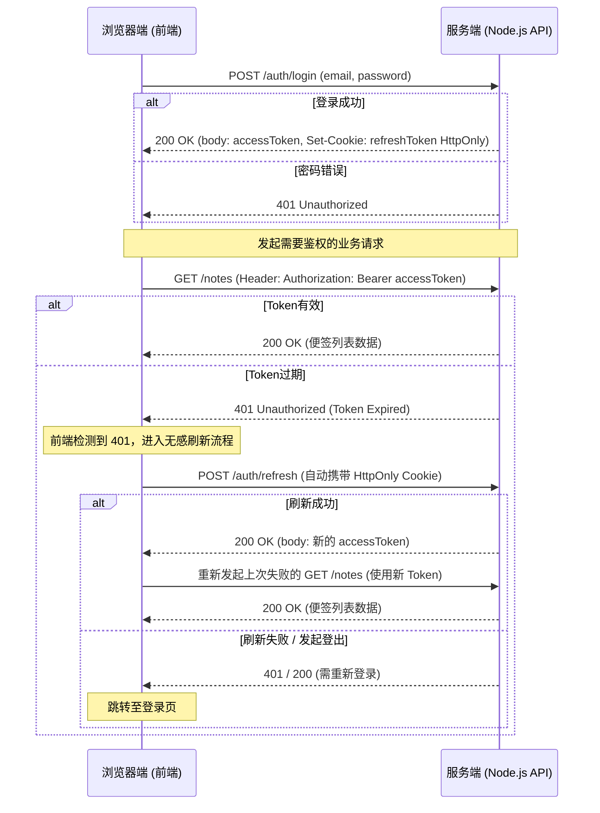
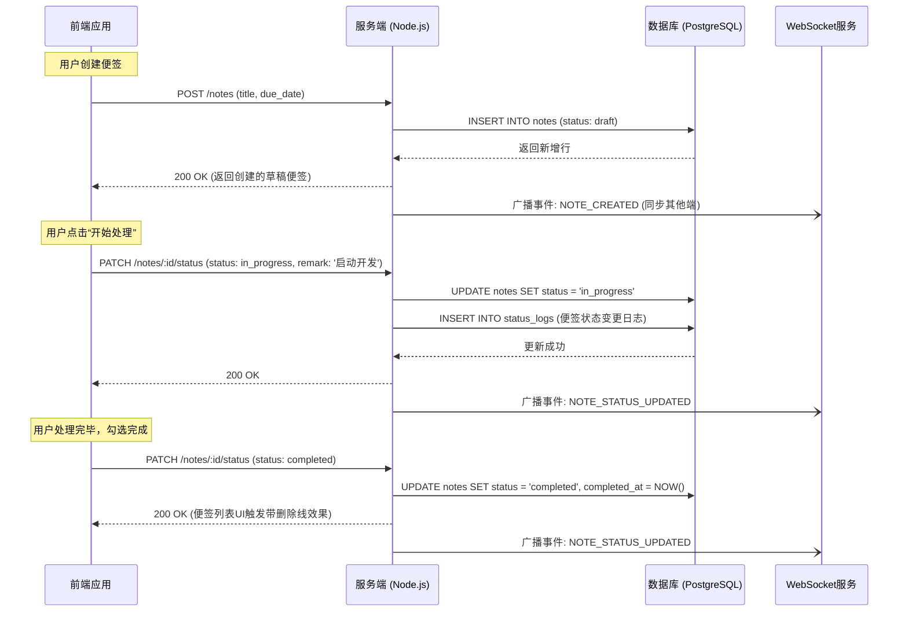
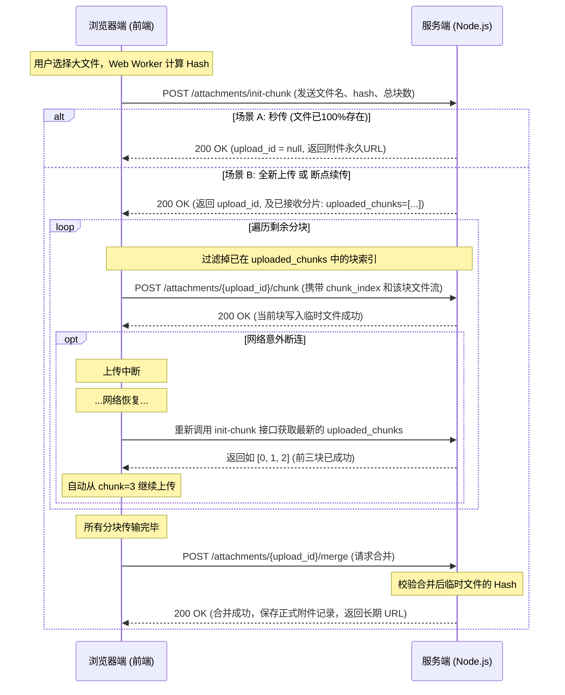

# 智能便签任务管理系统 — API 接口设计文档

**版本**：v1.0  
**日期**：2026-03-03  

---

## 1. 总体说明

### 1.1 基础路径
所有 API 请求的基础路径统一规范为：`/api/v1`

### 1.2 认证机制
- **鉴权方式**：JWT (JSON Web Token)
- **请求头携带**：`Authorization: Bearer <Access_Token>`
- **刷新机制**：Refresh Token 存储于 `httpOnly Cookie` 中，通过调用刷新接口获取新的 Access Token，增强安全性。

### 1.3 数据交互格式
- **请求 Content-Type**：通常为 `application/json`；上传文件附件时为 `multipart/form-data`。
- **响应 Content-Type**：`application/json`。

### 1.4 标准响应格式

**成功响应**：
```json
{
  "code": 200,
  "message": "success",
  "data": { ... } // 具体的业务数据结构
}
```

**错误响应**：
```json
{
  "code": 400, // HTTP 状态码或具体的业务错误码
  "message": "错误提示信息（如：标题不能为空）",
  "error": "Bad Request" // 具体错误类型/堆栈（生产环境可选隐藏）
}
```

---

## 2. 接口列表

### 2.1 认证模块 (Auth)

此模块处理家庭成员的账号系统。

| 接口名称       | Method | Path             | 请求参数/体                           | 响应/说明                                                       |
| -------------- | ------ | ---------------- | ------------------------------------- | --------------------------------------------------------------- |
| **用户注册**   | `POST` | `/auth/register` | `email`, `password`, `username`       | 返回新用户信息                                                  |
| **用户登录**   | `POST` | `/auth/login`    | `email`, `password`                   | 返回 `accessToken`、用户信息；并在 Cookie 中设置 `refreshToken` |
| **刷新 Token** | `POST` | `/auth/refresh`  | 无（依赖 Cookie 中的 `refreshToken`） | 返回新的 `accessToken`                                          |
| **用户登出**   | `POST` | `/auth/logout`   | 无                                    | 清除 Cookie，将当前 `refreshToken` 标记黑名单失效               |

#### 认证机制与无感刷新交互时序图



#### 认证接口响应体示例

**POST /auth/register → 201 Created**
```json
{
  "code": 200, "message": "success",
  "data": {
    "accessToken": "eyJhbGciOiJSUzI1NiJ9...",
    "user": {
      "id": "a1b2c3d4-e5f6-7890-abcd-ef1234567890",
      "username": "lichao",
      "email": "lichao@example.com",
      "avatar_url": null,
      "status": 1,
      "created_at": "2026-03-04T10:00:00Z"
    }
  }
}
```

**POST /auth/login → 200 OK**
```json
{
  "code": 200, "message": "success",
  "data": {
    "accessToken": "eyJhbGciOiJSUzI1NiJ9...",
    "user": {
      "id": "a1b2c3d4-e5f6-7890-abcd-ef1234567890",
      "username": "lichao",
      "email": "lichao@example.com",
      "avatar_url": "https://notes.example.com/static/avatars/a1b2c3d4.png",
      "preferences": { "language": "zh-CN", "theme": "dark" },
      "status": 1
    }
  }
}
```
> 同时响应头设置：`Set-Cookie: refreshToken=<token>; HttpOnly; Secure; SameSite=Strict; Max-Age=604800`

**POST /auth/refresh → 200 OK**
```json
{
  "code": 200, "message": "success",
  "data": { "accessToken": "eyJhbGciOiJSUzI1NiJ9..." }
}
```

---

### 2.2 便签模块 (Notes)

核心 CRUD 与状态流转。

| 接口名称         | Method   | Path                 | 请求参数/体                                                                                                                                                                                                                                                                   | 响应/说明                                                      |
| ---------------- | -------- | -------------------- | ----------------------------------------------------------------------------------------------------------------------------------------------------------------------------------------------------------------------------------------------------------------------------- | -------------------------------------------------------------- |
| **获取便签列表** | `GET`    | `/notes`             | **Query**: `page`, `limit`, `keyword` (搜索), `status`（**分区参数**：`active`=主工作区, `history`=历史记录, `suspended`=悬挂列表, `deleted`=垃圾桶；也可传具体状态值如 `in_progress`）, `color`, `start_date`, `end_date`, `sort_by`（默认 `priority_desc,created_at_desc`） | 分页返回对应分区的便签列表（含子任务进度统计）                 |
| **创建便签**     | `POST`   | `/notes`             | **Body**: `title`(必填), `color`(必填), `due_date`(**选填**，不传则为 null), `content`, `tags`, `priority`                                                                                                                                                                    | 创建成功，初始状态自动设为 `in_progress`，返回新创建的便签对象 |
| **获取便签详情** | `GET`    | `/notes/:id`         | 无                                                                                                                                                                                                                                                                            | 返回便签详细信息，含子任务、附件和协作者列表                   |
| **更新便签**     | `PUT`    | `/notes/:id`         | **Body**: 允许更新 `title`, `content`, `color`, `priority`, `tags` 等                                                                                                                                                                                                         | 返回更新后的便签对象                                           |
| **更新便签状态** | `PATCH`  | `/notes/:id/status`  | **Body**: `status` (目标状态), `remark` (备注信息)                                                                                                                                                                                                                            | 触发状态流转，记录状态变更日志，返回更新后的便签               |
| **移入回收站**   | `DELETE` | `/notes/:id`         | 无                                                                                                                                                                                                                                                                            | 软删除（设置 `deleted_at`），返回成功提示                      |
| **恢复便签**     | `POST`   | `/notes/:id/restore` | 无                                                                                                                                                                                                                                                                            | 清除 `deleted_at`，返回恢复后的便签                            |
| **彻底删除便签** | `DELETE` | `/notes/:id/force`   | 无                                                                                                                                                                                                                                                                            | 物理删除及级联删除关联附件和数据                               |

#### 便签状态流转交互时序图



#### 便签接口补充说明

**sort_by 可选枚举值（AN-3）**

| 枚举值            | 说明                                   |
| ----------------- | -------------------------------------- |
| `priority_desc`   | 优先级降序（默认，高→低）              |
| `priority_asc`    | 优先级升序                             |
| `created_at_desc` | 创建时间降序（新→旧，默认次序）        |
| `created_at_asc`  | 创建时间升序                           |
| `due_date_asc`    | 截止日期升序（最近截止优先，null排末） |
| `due_date_desc`   | 截止日期降序                           |
| `updated_at_desc` | 最近修改降序                           |

默认排序组合：`priority_desc,created_at_desc`（逗号分隔传多个值）

---

**GET /notes 列表项响应体（AN-1）→ 200 OK**
```json
{
  "code": 200, "message": "success",
  "data": {
    "total": 42,
    "page": 1,
    "limit": 10,
    "items": [
      {
        "id": "note-uuid-001",
        "title": "准备 Q1 季度汇报 PPT",
        "color": "red",
        "priority": "urgent",
        "status": "in_progress",
        "due_date": "2026-03-05T18:00:00Z",
        "tags": ["工作", "汇报"],
        "subtask_total": 3,
        "subtask_completed": 1,
        "has_attachments": true,
        "created_at": "2026-03-01T09:00:00Z",
        "updated_at": "2026-03-03T14:30:00Z"
      }
    ]
  }
}
```

---

**GET /notes/:id 详情响应体（AN-2）→ 200 OK**
```json
{
  "code": 200, "message": "success",
  "data": {
    "id": "note-uuid-001",
    "title": "准备 Q1 季度汇报 PPT",
    "content": "## 提纲\n- 背景分析\n- 数据复盘",
    "color": "red",
    "priority": "urgent",
    "status": "in_progress",
    "due_date": "2026-03-05T18:00:00Z",
    "tags": ["工作", "汇报"],
    "pin_top": false,
    "created_at": "2026-03-01T09:00:00Z",
    "updated_at": "2026-03-03T14:30:00Z",
    "completed_at": null,
    "subtasks": [
      {
        "id": "sub-uuid-001",
        "parent_id": null,
        "title": "整理数据",
        "is_completed": true,
        "sort_order": 1,
        "children": [
          {
            "id": "sub-uuid-002",
            "parent_id": "sub-uuid-001",
            "title": "导出报表",
            "is_completed": false,
            "sort_order": 1,
            "children": []
          }
        ]
      }
    ],
    "attachments": [
      {
        "id": "att-uuid-001",
        "filename": "Q1数据.xlsx",
        "file_type": "application/vnd.openxmlformats-officedocument.spreadsheetml.sheet",
        "file_size": 204800,
        "url": "/static/uploads/a1b2/2026-03/att-uuid-001.xlsx",
        "created_at": "2026-03-02T10:00:00Z"
      }
    ],
    "collaborators": [
      { "user_id": "user-uuid-002", "username": "wangfang", "permission": "edit" }
    ],
    "activity_logs": [
      {
        "id": 1001,
        "action_type": "CREATE",
        "operator": { "id": "user-uuid-001", "username": "lichao" },
        "detail": null,
        "created_at": "2026-03-01T09:00:00Z"
      },
      {
        "id": 1002,
        "action_type": "UPDATE_STATUS",
        "operator": { "id": "user-uuid-001", "username": "lichao" },
        "detail": { "from": "draft", "to": "in_progress", "remark": "开始处理" },
        "created_at": "2026-03-01T09:30:00Z"
      },
      {
        "id": 1003,
        "action_type": "UPLOAD_FILE",
        "operator": { "id": "user-uuid-001", "username": "lichao" },
        "detail": { "filename": "Q1数据.xlsx" },
        "created_at": "2026-03-02T10:00:00Z"
      }
    ]
  }
}
```
> **AS-1 决策**：子任务数据（`subtasks`）直接内嵌在便签详情接口返回，采用树形嵌套结构（`children` 数组），最多3层。不提供独立分页接口，简化前端状态管理。

---

### 2.3 子任务模块 (Subtasks)

支持最多 3 层嵌套的子任务管理。

| 接口名称         | Method   | Path                                 | 请求参数/体                                                                 | 响应/说明                |
| ---------------- | -------- | ------------------------------------ | --------------------------------------------------------------------------- | ------------------------ |
| **添加子任务**   | `POST`   | `/notes/:noteId/subtasks`            | **Body**: `title`, `status`, `assignee`, `due_date`, `parent_id` (支持嵌套) | 返回新创建的子任务       |
| **更新子任务**   | `PUT`    | `/notes/:noteId/subtasks/:subtaskId` | **Body**: `title`, `status`, `assignee`, `due_date`, `sort_order`           | 返回更新后的子任务       |
| **删除子任务**   | `DELETE` | `/notes/:noteId/subtasks/:subtaskId` | 无                                                                          | 成功提示                 |
| **子任务批量排** | `PATCH`  | `/notes/:noteId/subtasks/reorder`    | **Body**: `[{ "id": "uuid-1", "sort_order": 1 }, ...]`                      | 拖拽排序后统一更新排序值 |

---

### 2.4 附件模块 (Attachments)

由于单文件最大限制达 100MB，为保证上传稳定性并支持断点续传，附件上传采用**分块上传（Chunked Upload）**机制。

| 接口名称           | Method   | Path                                         | 请求参数/体                                                                                 | 响应/说明                                                                                                                                                                                                        |
| ------------------ | -------- | -------------------------------------------- | ------------------------------------------------------------------------------------------- | ---------------------------------------------------------------------------------------------------------------------------------------------------------------------------------------------------------------- |
| **小文件直接上传** | `POST`   | `/notes/:noteId/attachments`                 | **Header**: `multipart/form-data`<br>**Body**: `files` (支持使用同名 key 传递多个文件流)    | 适用于较小的文件（如 < 5MB）。处理多文件流式写入本地，返回新增加的附件记录数组。                                                                                                                                 |
| **初始化分块上传** | `POST`   | `/notes/:noteId/attachments/init-chunk`      | **Body**: `filename`, `file_size`, `total_chunks`, `hash` (文件哈希值，必填)                | 初始化分配一个唯一的 `upload_id`。**支持断点续传/秒传**：如果该 `hash` 对应的文件曾上传过一部分，服务端会返回已接收的分片索引数组（`uploaded_chunks`），前端只需上传剩余分片即可。如果已完全存在，可实现“秒传”。 |
| **上传文件分块**   | `POST`   | `/notes/:noteId/attachments/:uploadId/chunk` | **Header**: `multipart/form-data`<br>**Body**: `chunk_index`, `chunk_data` (该分块的文件流) | 追加此分块数据。若中间网络断连，重新调初始化接口再次读取 `uploaded_chunks`，从断掉的 `chunk_index` 继续即可。                                                                                                    |
| **合并文件分块**   | `POST`   | `/notes/:noteId/attachments/:uploadId/merge` | **Body**: `filename`, `total_chunks`, `hash`                                                | 所有分部分片传输完毕后触发，服务端验证完整哈希后组装为正式附件，返回完整的附件信息及访问路径。                                                                                                                   |
| **删除附件**       | `DELETE` | `/notes/:noteId/attachments/:attachmentId`   | 无                                                                                          | 成功提示（服务端物理删除硬盘对应文件）                                                                                                                                                                           |
| **附件静态鉴权**   | `GET`    | `/auth/file`                                 | Nginx 回调，携带原有请求的 Cookie/Header                                                    | Nginx `auth_request` 专用。鉴权通过返回 `200`，不通过返回 `403`。Node.js 不返回文件本身。                                                                                                                        |

#### 分块与断点续传交互时序图（Chunked & Resumable Upload）



#### 附件模块补充说明

**AA-2：上传模式触发阈值（前后端统一标准）**

| 文件大小   | 上传模式   | 前端行为                                            |
| ---------- | ---------- | --------------------------------------------------- |
| < **5 MB** | 小文件直传 | 直接调用 `POST /attachments`，`multipart/form-data` |
| ≥ **5 MB** | 分块上传   | 调用 `init-chunk` → 循环 `chunk` → `merge`          |

> 前端 SDK 统一判断阈值为 `5 * 1024 * 1024` 字节（5 MiB），超出则自动切换分块模式，每片大小为 **2 MB**。

---

**AA-1：附件响应字段完整结构**

小文件上传成功 `POST /attachments → 200 OK`：
```json
{
  "code": 200, "message": "success",
  "data": [
    {
      "id": "att-uuid-001",
      "note_id": "note-uuid-001",
      "filename": "设计稿.png",
      "file_type": "image/png",
      "file_size": 1048576,
      "url": "/static/uploads/a1b2/2026-03/att-uuid-001.png",
      "md5_hash": "d41d8cd98f00b204e9800998ecf8427e",
      "created_at": "2026-03-04T10:00:00Z"
    }
  ]
}
```

分块合并成功 `POST /attachments/:uploadId/merge → 200 OK`：
```json
{
  "code": 200, "message": "success",
  "data": {
    "id": "att-uuid-002",
    "note_id": "note-uuid-001",
    "filename": "录屏演示.mp4",
    "file_type": "video/mp4",
    "file_size": 52428800,
    "url": "/static/uploads/a1b2/2026-03/att-uuid-002.mp4",
    "md5_hash": "abc123def456...",
    "created_at": "2026-03-04T10:05:00Z"
  }
}
```

---

### 2.5 协作模块 (Collaborations)

家庭内部成员的共享协作授权。

| 接口名称       | Method   | Path                                   | 请求参数/体                                              | 响应/说明                                  |
| -------------- | -------- | -------------------------------------- | -------------------------------------------------------- | ------------------------------------------ |
| **邀请协作者** | `POST`   | `/notes/:noteId/collaborators`         | **Body**: `user_id` (被邀请人), `permission` (read/edit) | 返回协作关系记录                           |
| **更新权限**   | `PUT`    | `/notes/:noteId/collaborators/:userId` | **Body**: `permission`                                   | 更新读写权限                               |
| **移除/退出**  | `DELETE` | `/notes/:noteId/collaborators/:userId` | 无                                                       | 移除该成员的被共享权限，或自身主动退出协作 |

---

### 2.6 统计与通知模块

| 接口名称           | Method | Path                       | 请求参数/体                                                                       | 响应/说明                                                                                       |
| ------------------ | ------ | -------------------------- | --------------------------------------------------------------------------------- | ----------------------------------------------------------------------------------------------- |
| **全局仪表盘统计** | `GET`  | `/statistics/dashboard`    | **Query**: `start_date`, `end_date`                                               | 包含状态分布、新建vs完成趋势、颜色分布、逾期记录的数据包                                        |
| **历史专项统计**   | `GET`  | `/statistics/history`      | **Query**: `start_date`, `end_date`, `group_by`（day/week/month）                 | 返回：完成趋势序列、平均处理时长（按颜色/优先级分组）、月度热力图数据、按标签排行、逾期完成率等 |
| **生成分析报表**   | `POST` | `/statistics/export`       | **Body**: `format` (pdf/csv), `start_date`, `end_date`, `scope`（global/history） | 异步生成报表并返回下载链接                                                                      |
| **订阅 Web Push**  | `POST` | `/notifications/subscribe` | **Body**: 浏览器生成的 `subscription` 对象                                        | 保存该终端的推送凭证                                                                            |

#### AK-1：仪表盘接口响应体示例（供 ECharts 对接）

**GET /statistics/dashboard → 200 OK**
```json
{
  "code": 200, "message": "success",
  "data": {
    "status_distribution": {
      "in_progress": 15,
      "suspended": 3,
      "completed": 42,
      "archived": 8
    },
    "trend": {
      "labels": ["2026-02-26", "2026-02-27", "2026-02-28", "2026-03-01", "2026-03-02", "2026-03-03", "2026-03-04"],
      "created": [2, 1, 3, 0, 2, 1, 4],
      "completed": [1, 2, 1, 3, 1, 2, 0]
    },
    "color_distribution": [
      { "color": "red",    "count": 8 },
      { "color": "orange", "count": 12 },
      { "color": "blue",   "count": 20 },
      { "color": "green",  "count": 10 },
      { "color": "yellow", "count": 5 },
      { "color": "purple", "count": 3 },
      { "color": "gray",   "count": 7 }
    ],
    "priority_distribution": {
      "urgent": 5,
      "high": 10,
      "medium": 25,
      "low": 15
    },
    "overdue_notes": [
      {
        "id": "note-uuid-003",
        "title": "提交季度报告",
        "due_date": "2026-02-28T18:00:00Z",
        "overdue_days": 4
      }
    ]
  }
}
```

> **ECharts 使用指引**：  
> - 折线图：`trend.labels` 作 `xAxis.data`，`trend.created` 和 `trend.completed` 作两条 `series`。  
> - 饼图：`status_distribution` / `priority_distribution` 转为 `[{ name, value }]` 数组。  
> - 条形图：`color_distribution` 直接映射 `xAxis.data` 和 `series[0].data`。

---

## 3. WebSocket 实时通信说明

为了实现多端实时同步（如状态变更、子任务修改的页面实时刷新、在线推送等），客户端需在登录成功后建立 WebSocket 连接。

- **连接端点**：`wss://<domain>/ws`（带上 Query 参数 `?token=<access_token>` 鉴权）
- **心跳机制**：每 30 秒客户端发送 `ping`，服务端回应 `pong`。
- **消息格式**：
  ```json
  {
    "type": "NOTE_UPDATED",
    "note_id": "uuid",
    "payload": { ... }
  }
  ```

#### AW-1：Token 过期时 WebSocket 重连策略

WebSocket 连接使用 `?token=<accessToken>` 鉴权，当 Token 过期时需遵循以下重连流程：

```
场景：WebSocket 连接中断（网络抖动 / Token 过期 / 服务端主动断开）
    │
    ├─ 1. 前端监听 onclose 事件，读取 CloseCode
    │      ├─ CloseCode = 4001 (鉴权失败/Token 过期)
    │      │      └─► 先调用 POST /auth/refresh 刷新 Token
    │      │              ├─ 刷新成功 → 使用新 Token 重建 WebSocket 连接
    │      │              └─ 刷新失败 → 跳转登录页（Refresh Token 也已过期）
    │      │
    │      └─ CloseCode = 1006 / 网络断开
    │             └─► 指数退避重连：1s → 2s → 4s → 8s → 最大 30s 间隔
    │                   连接成功后，前端主动拉取一次最新便签状态（补偿断线期间的变更）
    │
    └─ 2. 重连时始终使用最新 accessToken，若本地 Token 已过期则先刷新再连接
```

**服务端规范**：
- Token 过期时主动发送 `CloseCode = 4001`，不使用默认的 `1000`。
- WebSocket 握手阶段验证失败时返回 HTTP `401`，前端捕获后进入上述 Token 刷新流程。

---
*本文档为后端开发及前端对接的核心契约，如有字段增减，请务必更新本文档。*
